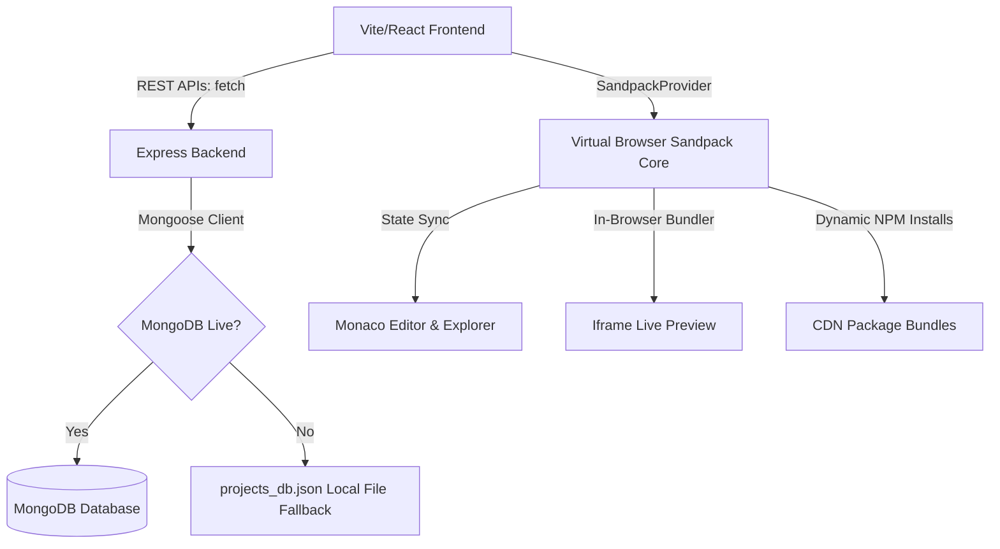

# ⚡ Developer Sandbox — Browser-Based Coding IDE

A premium, full-stack browser-based developer assessment workspace built on the **MERN Stack** (MongoDB, Express, React, Node.js). Candidates can write code, install external npm packages, manage files and folders, preview their app in real-time, and persist their sandbox session across reboots.

> **Zero-config startup** — runs fully without any database setup. If MongoDB is unavailable, a local JSON fallback activates automatically. Single command launch: `npm start`.

---

## 🚀 Key Features

- **Monaco Code Editor** — Core editor powered by Monaco (the heart of VS Code). Full syntax highlighting, tabbed multi-file workspace, smooth caret animations, automatic word wrap.
- **Near Real-Time Browser Compilation** — Embedded iframe live preview powered by CodeSandbox Sandpack Core with built-in HMR. Reacts instantly to editor changes; loads npm dependencies client-side via CDN — no build step required.
- **Virtual File Manager** — Sidebar file-explorer tree for creating, nesting, and deleting workspace files. Directories modelled as flat path keys (e.g. `/src/components/Btn.jsx`) — no real filesystem required.
- **Dynamic NPM Package Installer** — Sidebar panel listing active dependencies, recommending popular packages, and performing safe in-browser npm installations by updating `package.json` inside the Sandpack virtual filesystem.
- **Double-Safe Session Persistence** — Primary: MongoDB via Mongoose. Automatic fallback: `projects_db.json` local JSON file activates if MongoDB port is unreachable. Debounced auto-save syncs 1500 ms after the user stops typing.
- **Glassmorphic IDE Aesthetics** — Modern dark-mode UI with glowing states, fluid transitions, collapsible sidebar tabs, custom scrollbars, and a built-in terminal console panel.

---

## 📁 Repository Structure

```
/banao-assignment
  ├── package.json               # Root orchestrator scripts (run dev concurrently)
  ├── README.md                  # Comprehensive documentation
  ├── /backend
  │   ├── server.js              # Express API Server, default project models & fallback DB
  │   ├── package.json           # Backend dependency lists (Express, Mongoose)
  │   ├── projects_db.json       # Offline local JSON database failover file
  │   └── .env.example           # Server port & database URI guidelines
  └── /frontend
      ├── index.html             # Google fonts & typography tokens
      ├── vite.config.js         # Port mapper and backend proxy settings
      ├── package.json           # Frontend tools (React 18, Monaco, Sandpack, Lucide)
      └── /src
          ├── main.jsx           # React app bootstrap
          ├── index.css          # CSS Variables, custom scrollbars, transitions
          ├── App.jsx            # Main workspace orchestrator & debounced auto-saver
          └── /components
              ├── Sidebar.jsx          # Vertical navigation
              ├── FileExplorer.jsx     # Recursive virtual directory explorer
              ├── PackageManager.jsx   # package.json dependency updater
              ├── ProjectList.jsx      # Saved sessions CRUD panel
              ├── EditorContainer.jsx  # Tabs switcher & Monaco integration
              ├── PreviewContainer.jsx # Live frame and logs terminal panels
              └── StatusBar.jsx        # Active indicators and connection monitors
```

---

## 🛠️ Installation & Run Instructions

### Prerequisites
- Node.js v18+ and npm v9+
- MongoDB on `localhost:27017` *(optional — JSON fallback activates automatically if absent)*

### 1. Install dependencies

Run at the root directory (`/banao-assignment`):

```bash
npm run install-all
```

### 2. Start the IDE

```bash
npm start
```

| Service | URL |
|---|---|
| Frontend Workspace | http://localhost:3000 |
| Backend API Server | http://localhost:5000 |
| MongoDB (optional) | mongodb://localhost:27017/banao_sandbox |

> **Offline mode:** If MongoDB is not running, the server checks the port with a lightweight TCP socket (400 ms timeout). If it's closed, the server logs a warning and immediately switches to `projects_db.json`. The IDE stays fully functional with zero configuration.

---

## 🏗️ Architecture & Tech Choices



```
Vite/React Frontend  ──► REST APIs (fetch) ──► Express Backend
                                                     │
                                          ┌──────────┴──────────┐
                                          ▼                      ▼
                                    MongoDB (live)     projects_db.json
                                                         (fallback)

SandpackProvider ──► normalizeSandpackFiles() ──► Monaco Editor
                 ──► In-Browser Bundler ──► iframe Live Preview
                 ──► Dynamic NPM installs via CDN (package.json updates)
```

### 1. In-Browser Compilation: Sandpack vs WebContainers

**Choice:** CodeSandbox Sandpack Core.

**Rationale:** StackBlitz WebContainers runs a full Node.js terminal in WebAssembly but requires custom COOP/COEP security headers that block loading images, fonts, and package scripts from external CDNs — making local hosting highly complex. Sandpack runs React templates natively in an isolated iframe, transpiles code client-side, loads dependencies instantly via CDN, and includes built-in HMR — the right tradeoff for a self-contained, zero-config assessment environment.

### 2. Double-Buffered Code State

The workspace maintains two parallel state layers:

| Layer | Description |
|---|---|
| **Client-Side Cache (Active)** | Managed in-browser by `SandpackProvider`. Every keystroke in Monaco feeds directly into the Sandpack runtime via `updateFile()` — zero latency. |
| **Server-Side Sync (Persistent)** | Handled via debounced API calls inside `SandboxWorkspace`. Changes are detected by comparing normalized file content against `savedAppRef` — only real edits trigger a save. |

### 3. File Normalization Layer

Because Sandpack's `template="react"` expects files at `/App.js` and `/styles.css`, but the project stores source under `/src/` (Vite layout), a normalizer bridges the two:

```js
// utils/normalizeSandpackFiles.js
export function normalizeSandpackFiles(files = {}, dependencies = {}) {
  // Strip Vite-specific files that crash the Sandpack bundler
  const STRIP = new Set([
    '/App.js', '/App.jsx', '/index.js', '/index.jsx',
    '/styles.css', '/index.html', '/public/index.html',
    '/vite.config.js', '/vite.config.ts',
  ]);

  // Point /App.js at our /src/App.jsx content
  if (out['/src/App.jsx']) {
    out['/App.js'] = out['/src/App.jsx'];
  }

  // Point /styles.css at our /src/index.css content
  if (out['/src/index.css']) {
    out['/styles.css'] = out['/src/index.css'];
  }

  // Strip Vite devDeps that crash the in-browser bundler
  delete pkg.dependencies['vite'];
  delete pkg.dependencies['@vitejs/plugin-react'];
}
```

This runs inside a `useMemo` keyed only on `activeProject._id` — so normalization happens once per project load, never on every auto-save cycle.

### 4. MongoDB Failsafe

The server checks whether the MongoDB port is open using a raw TCP socket before attempting Mongoose connection:

```js
// server.js
function checkMongoPort(host, port, timeout = 400) {
  return new Promise((resolve) => {
    const socket = new net.Socket();
    socket.setTimeout(timeout);
    socket.once('connect', () => { socket.destroy(); resolve(true); });
    socket.once('timeout', () => { socket.destroy(); resolve(false); });
    socket.once('error', () => { socket.destroy(); resolve(false); });
    socket.connect(port, host);
  });
}
```

If the port is closed, the failsafe activates instantly — no 30-second Mongoose timeout. All API routes (`GET /api/projects`, `POST`, `PUT`, `DELETE`) check the `isLocalDB` flag and branch accordingly, so the API contract stays identical in both modes.

---

## 🐛 Bug Fix: Broken Session Persistence

### The Problem

When loading a saved project, the Monaco editor and Sandpack preview were not fully refreshing — files from the previous session or a mix of old and new content appeared instead of the loaded project's files.

### Root Cause Analysis

Three separate issues compounded to cause this:

**1. SandpackProvider lifecycle — stale internal state**

When switching projects, only the `files` prop on `SandpackProvider` was being updated. React re-renders the component with new props, but does not remount it. So Sandpack's internal state — active file cursor, bundler module registry, HMR cache — held stale values from the prior session. The new files were technically present but Sandpack was in a confused state.

**2. Auto-save race condition — empty state written back to DB**

The `SandboxWorkspace` component (child of `SandpackProvider`) initialises with the new project's files, but the auto-save `useEffect` was watching `files['/App.js']?.code` — which briefly reads as empty during the remount phase. The 1500 ms debounce would fire, detect a "change" from the previous saved ref, and write the empty state back to the database — corrupting the just-loaded project.

**3. `useMemo` on `sandpackFiles` recomputing on save**

`sandpackFiles` was originally depending on the full `activeProject` object. Every auto-save updated `activeProject.updatedAt`, which caused `sandpackFiles` to recompute — triggering `SandpackProvider` to re-initialize mid-session, resetting the editor state on every save.

---

### Fixes Applied

**Fix 1 — Dynamic remount key on `SandpackProvider`** (`App.jsx`)

```jsx
// App.jsx
<SandpackProvider
  key={activeProject._id}   // forces full unmount + remount on project switch
  template="react"
  theme="dark"
  files={sandpackFiles}
  customSetup={{ dependencies: sandpackDeps }}
  options={{
    activeFile: '/App.js',
    autorun: true,
    recompileMode: 'immediate',
    recompileDelay: 0
  }}
>
  <SandboxWorkspace ... />
</SandpackProvider>
```

When `activeProject._id` changes, React sees a new `key` and fully unmounts the old `SandpackProvider` — destroying all internal bundler state. The new instance initialises completely fresh with the correct file map.

---

**Fix 2 — `isInitialMountRef` guard prevents auto-save on load** (`App.jsx`)

The auto-save `useEffect` inside `SandboxWorkspace` now uses a ref-based flag that blocks saving for 2 seconds after mount, giving Sandpack time to fully initialise before any save comparison runs:

```js
// App.jsx — SandboxWorkspace
const isInitialMountRef = useRef(true);
const isSavingRef = useRef(false);

// On mount, record the server's file state and enable auto-save after 2s
useEffect(() => {
  savedAppRef.current = files['/App.js']?.code ?? null;
  savedCssRef.current = files['/styles.css']?.code ?? null;

  const timer = setTimeout(() => {
    isInitialMountRef.current = false;
    console.log('[Auto-save] Now active and watching for changes');
  }, 2000);

  return () => clearTimeout(timer);
}, []); // runs once on mount only

// Debounced auto-save — skips initial mount, skips if already saving
useEffect(() => {
  if (isInitialMountRef.current) return; // block during mount phase
  if (isSavingRef.current) return;       // prevent infinite loop
  if (savedAppRef.current === null) return;

  const currentApp = files['/App.js']?.code ?? '';
  const currentCss = files['/styles.css']?.code ?? '';

  // Normalize whitespace to avoid false-positive saves
  const normalize = (code) => code.trim().replace(/\s+/g, ' ');
  if (
    normalize(currentApp) === normalize(savedAppRef.current) &&
    normalize(currentCss) === normalize(savedCssRef.current)
  ) return; // nothing actually changed

  console.log('[Auto-save] Detected real changes, saving in 1.5s...');
  if (saveTimeoutRef.current) clearTimeout(saveTimeoutRef.current);
  setIsSaving(true);
  isSavingRef.current = true;

  saveTimeoutRef.current = setTimeout(async () => {
    try {
      // Save only /src/* files — not the Sandpack shims
      const srcFiles = {};
      Object.entries(files).forEach(([path, fileObj]) => {
        if (path.startsWith('/src/') || path === '/package.json') {
          srcFiles[path] = fileObj.code;
        }
      });
      if (files['/App.js'])    srcFiles['/src/App.jsx']   = files['/App.js'].code;
      if (files['/styles.css']) srcFiles['/src/index.css'] = files['/styles.css'].code;

      const response = await fetch(`/api/projects/${activeProject._id}`, {
        method: 'PUT',
        headers: { 'Content-Type': 'application/json' },
        body: JSON.stringify({ files: srcFiles, dependencies, activeFile })
      });
      if (!response.ok) throw new Error('Sync failed');

      const updatedProj = await response.json();

      // Only update the timestamp in the project list — NOT activeProject itself.
      // This prevents sandpackFiles useMemo from recomputing and resetting the editor.
      setProjects(prev => prev.map(p =>
        p._id === activeProject._id ? { ...p, updatedAt: updatedProj.updatedAt } : p
      ));

      savedAppRef.current = currentApp;
      savedCssRef.current = currentCss;
    } catch (err) {
      console.error('Auto-save error:', err);
    } finally {
      setIsSaving(false);
      isSavingRef.current = false;
    }
  }, 1500);

  return () => { if (saveTimeoutRef.current) clearTimeout(saveTimeoutRef.current); };
}, [files['/App.js']?.code, files['/styles.css']?.code]);
```

---

**Fix 3 — `useMemo` keyed on `_id` only, not the full project object** (`App.jsx`)

```js
// App.jsx
const sandpackFiles = useMemo(() => {
  if (!activeProject?.files) return {};
  const normalized = normalizeSandpackFiles(
    activeProject.files,
    activeProject.dependencies
  );
  const formatted = {};
  Object.entries(normalized).forEach(([path, content]) => {
    formatted[path] = { code: content };
  });
  return formatted;
}, [activeProject?._id]); // ← only _id, NOT updatedAt or the full object

const sandpackDeps = useMemo(() => ({
  react: '^18.2.0',
  'react-dom': '^18.2.0',
  ...(activeProject?.dependencies || {})
}), [activeProject?._id]); // only recomputes when project actually changes
```

Keying both memos on `_id` only means auto-saves (which update `updatedAt` on the project list) never trigger a `SandpackProvider` reset mid-session.

---

**Fix 4 — Editor shim sync in `EditorContainer`**

Because Sandpack's template uses `/App.js` and `/styles.css` as entry points but Monaco edits `/src/App.jsx`, the editor manually keeps the shims in sync on every keystroke:

```js
// EditorContainer.jsx
const handleEditorChange = (value) => {
  if (!activeFile) return;
  updateFile(activeFile, value || '');

  // Keep Sandpack template shims in sync with /src edits
  if (activeFile === '/src/App.jsx') {
    updateFile('/App.js', value || '');
  }
  if (activeFile === '/src/index.css') {
    updateFile('/styles.css', value || '');
  }
};
```

This ensures the live preview always reflects what the user is typing in the `/src/` files, without needing a separate compilation step.

---

**Result:** Project switching now fully resets the editor, preview, active file tab, and bundler state. Auto-save never fires during load. Both `SandpackProvider` remount and save cycles are fully decoupled — the editor runs smoothly mid-session without any state bleed between projects.

---

## 🤖 AI Leverage & Prompt Engineering Workflow

AI was used as an active pair programmer — accelerating implementation of well-defined tasks while architectural decisions remained the developer's own.

### Where AI helped

| Area | How AI Was Used |
|---|---|
| CSS Design Tokens | Crafted neon hue variables, custom scrollbar styles, and glassmorphic layout systems inside `index.css` |
| Failsafe Middleware | Designed the TCP socket port-check approach in `server.js` for instant failover without Mongoose timeout delays |
| Remount Strategy | Proposed the `key={activeProject._id}` pattern on `SandpackProvider` after the developer described stale closure behaviour during project switching |
| Boilerplate | Generated repetitive component scaffolding (Sidebar, StatusBar, FileExplorer) from natural language descriptions |

### Where the developer reasoned independently

- **Sandpack vs WebContainers** — researched COOP/COEP header constraints and made the tradeoff call based on hosting requirements
- **`useMemo` keyed on `_id` only** — identified that keying on the full `activeProject` object caused mid-session resets; fixed the dependency array manually
- **`isInitialMountRef` 2-second guard** — designed the mount phase protection window after observing the race condition in DevTools
- **Shim sync in `handleEditorChange`** — identified that `/App.js` and `/src/App.jsx` needed to be kept in sync manually because Sandpack only watches its own virtual paths
- **Save only `/src/*` files** — decided to strip Sandpack shim paths (`/App.js`, `/styles.css`) from what gets written back to the database, keeping server state clean

> AI was a pair programmer, not an author. All debugging, architectural decisions, and final implementation choices were made by the developer.

---

## ⚖️ Technical Trade-offs & Known Limitations

### Trade-offs

| Trade-off | Detail |
|---|---|
| Client-Side Transpilation | The bundler runs inside the browser. Large packages (e.g. three.js) may take a few seconds to compile on slower devices. |
| Virtual Folder Model | Sandpack files are stored as flat path keys in-memory. Deleting a folder purges all files matching that path prefix string. |
| Shim Layer Overhead | Bridging Vite's `/src/` layout to Sandpack's `/App.js` entry requires a normalization step and manual shim sync on every keystroke — a small but real overhead. |
| Debounced Save Latency | A 1500 ms idle window means a hard browser crash within this window could lose the last few keystrokes. |

### Known Limitations

- **Node native libraries** — the Sandpack compiler cannot execute server-only packages (`child_process`, `fs`, `net`, etc.) as it runs sandboxed in a browser context.
- **Vite configuration** — users can edit `.jsx`, `.css`, and `.json` files. Core Vite config is managed internally by the Sandpack compiler core.
- **Large bundle sizes** — packages over ~2 MB may cause noticeable compile delays due to browser-side bundling constraints.

---

##  Walkthrough

### Segment 1 - Opening

- I built a fully browser-based coding IDE where a developer candidate can write code, install packages, see a live preview, and come back later with their session exactly where they left it
- The stack is React 18 on the frontend with Vite, Express and Node.js on the backend, and MongoDB for persistence with an automatic JSON fallback if the database isn't running
- The two things that were non-negotiable: it had to start with zero configuration so an evaluator can clone it and run one command, and session persistence had to be rock solid so a candidate never loses their work mid-task

### Segment 2 — Architecture 

- I chose Sandpack over WebContainers because WebContainers requires COOP/COEP security headers that break external CDN loading — no fonts, no images, no package scripts. Sandpack runs React templates in an isolated iframe, pulls packages from CDN on demand, and has HMR built in. For a zero-config local host, it was clearly the right call
- The state is double-buffered — Sandpack holds the live in-memory state so every keystroke feels instant, and a separate debounced effect in `App.jsx` waits 1500 ms of idle time before syncing to the backend. I also added `isInitialMountRef` which blocks the auto-save from running for the first 2 seconds after mount so it never fires during the load phase
- I wrote `normalizeSandpackFiles.js` to bridge the gap between Vite's `/src/` file layout and Sandpack's expected `/App.js` entry point — it strips Vite-specific files that crash the in-browser bundler and maps `/src/App.jsx` content to `/App.js` so the preview works without any config changes
- I set `key={activeProject._id}` on `SandpackProvider` so that every time the active project changes, React fully unmounts and remounts the provider — wiping all internal bundler state clean instead of trying to update it in place
- In `server.js`, I check whether the MongoDB port is actually open using a raw TCP socket with a 400 ms timeout before even attempting a Mongoose connection. If the port is closed, the failsafe activates instantly and all API routes switch to reading and writing `projects_db.json` — the API contract stays identical either way

### Segment 3 — AI Usage 

- I used AI to generate the CSS design token system in `index.css` — the neon variables, custom scrollbars, and glassmorphic dark theme. I described the aesthetic I wanted and tweaked what it produced
- I used AI to wire up the MongoDB failsafe middleware in `server.js` — I knew the logic I wanted, AI helped me write the TCP socket check and the `isLocalDB` branching cleanly
- I described the stale closure problem I was seeing when switching projects and AI suggested the `key={activeProject._id}` remount pattern — I then understood it, verified it fixed the right thing, and implemented it
- The decisions I made myself: choosing Sandpack over WebContainers after reading both docs, fixing the `useMemo` dependency array to key on `_id` only after I traced the mid-session reset to `updatedAt` changing, designing the `isInitialMountRef` 2-second window after I saw the race condition in DevTools, and writing the shim sync in `handleEditorChange` after realising Sandpack only watches its own virtual paths

### Segment 4 — Bug Fix 

- The bug was that switching projects didn't fully reset the editor and preview — you'd see files from the old session bleeding into the new one
- Root cause 1: `SandpackProvider` was staying mounted across project switches. Updating the `files` prop re-renders it but doesn't remount it, so the internal bundler state — active file, HMR cache, module registry — all carried over from the previous session. I fixed this by setting `key={activeProject._id}` so React tears down and rebuilds the whole provider on every project change
- Root cause 2: the auto-save `useEffect` was watching `files['/App.js']?.code` and would fire during the remount phase when that value was briefly empty. It would compare the empty string against the previous `savedAppRef`, think something changed, and write the empty state back to the database — corrupting the project that was just loaded. I fixed this with `isInitialMountRef`, a ref that stays `true` for 2 seconds after mount and causes the auto-save to return early if it's still in that window
- Root cause 3: `sandpackFiles` was inside a `useMemo` that depended on the full `activeProject` object. Every auto-save updated `activeProject.updatedAt` on the project list, which caused the memo to recompute and `SandpackProvider` to re-initialize mid-session — resetting the editor state on every save. I fixed the dependency array to `[activeProject?._id]` only, so the memo only recomputes when the project actually changes, not when timestamps update
- Root cause 4: Monaco edits `/src/App.jsx` but Sandpack's template entry point is `/App.js`. I wasn't keeping the two in sync, so the live preview wasn't reflecting what the user was typing. I fixed this in `handleEditorChange` by calling `updateFile('/App.js', value)` whenever the active file is `/src/App.jsx`, and the same for `/styles.css` ↔ `/src/index.css`

### Segment 5 — Closing 

- Known limitations: server-only Node.js packages like `child_process` and `fs` can't run in the sandboxed browser context, the shim layer adds a small overhead on every keystroke to keep `/App.js` in sync, and large packages take a few seconds to bundle client-side
- If I had more time I'd look at WebContainers for Node.js native package support, add collaborative cursors via socket.io, and replace the full-file sync with a diff-based approach to reduce payload size on every save
- The MongoDB failsafe means anyone grading this can run `npm start` with no database setup and get a fully working IDE — that was a deliberate design decision, not an afterthought
