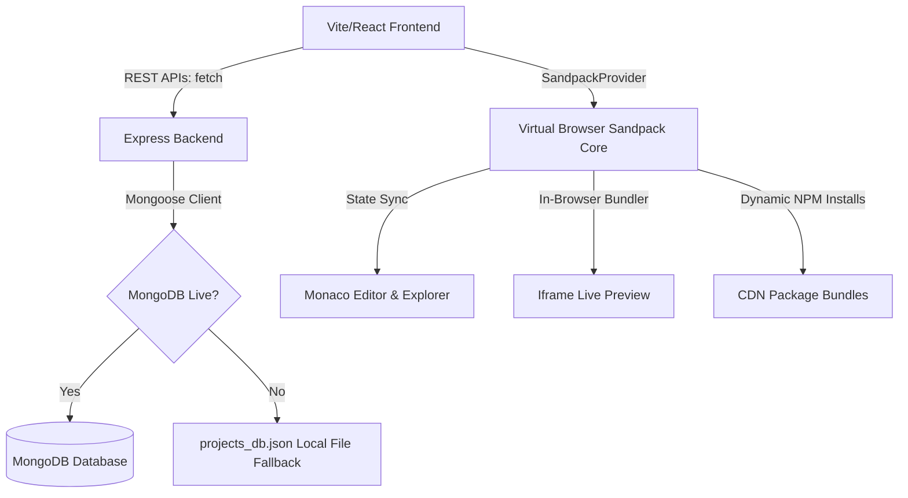

# ⚡ Developer Sandbox - Browser-Based Coding IDE

A premium, full-stack browser-based developer assessment workspace built on the **MERN Stack** (MongoDB, Express, React, Node.js). This application enables candidates to write code, install external npm packages, manage files/folders, preview their applications in real-time, and persist their sandbox session across reboots.

---

## 🚀 Key Features

*   **Monaco Code Editor**: Core editor powered by Monaco Editor (the heart of VS Code). Supports full syntax highlighting, tabbed workspace, custom configurations, smooth caret animations, and automatic word wrap.
*   **Near Real-time Browser Compilations**: Embedded iframe live preview compiler powered by CodeSandbox Sandpack core, reacting instantly to updates.
*   **Virtual File Manager**: Sidebar file explorer tree enabling creation, nested folder management, and safe deletion of workspace files.
*   **Dynamic NPM Package Installer**: Sidebar package manager listing active dependencies, recommending popular additions, and performing safe in-browser npm installations.
*   **Double-Safe Session Persistence**: Seamless backend syncing backed by a **MongoDB failsafe fallback** that automatically starts an offline JSON database (`projects_db.json`) if a MongoDB connection fails, ensuring zero-config out-of-the-box evaluation!
*   **Vibrant Glassmorphic Aesthetics**: Modern dark-mode IDE with glowing states, fluid transitions, collapsible tabs, and custom logs terminal display.

---

## 📁 Repository Structure

```
/banao-assignment
  ├── package.json               # Root orchestrator scripts (run dev concurrently)
  ├── README.md                  # Comprehensive documentation
  ├── /backend
  │   ├── server.js              # Express API Server, default project models & fallback DB
  │   ├── package.json           # Backend dependency lists (Express, Mongoose)
  │   ├── projects_db.json       # Offline local JSON database failover file
  │   └── .env.example           # Server port & database URI guidelines
  └── /frontend
      ├── index.html             # Google fonts & typography tokens
      ├── vite.config.js         # Port mapper and backend proxy settings
      ├── package.json           # Frontend tools (React 18, Monaco, Sandpack, Lucide)
      └── /src
          ├── main.jsx           # React app bootstrap
          ├── index.css          # CSS Variables, custom scrollbars, transitions
          ├── App.jsx            # Main workspace orchestrator & debounced auto-saver
          └── /components
              ├── Sidebar.jsx          # Vertical navigation
              ├── FileExplorer.jsx     # Recursive virtual directory explorer
              ├── PackageManager.jsx   # package.json dependency updater
              ├── ProjectList.jsx      # Saved sessions CRUD panel
              ├── EditorContainer.jsx  # Tabs switcher & Monaco integration
              ├── PreviewContainer.jsx # Live frame and logs terminal panels
              └── StatusBar.jsx        # Active indicators and connection monitors
```

---

## 🛠️ Installation & Run Instructions

The workspace is set up to install all dependencies and run both servers simultaneously using a single terminal launcher.

### 1. Fast Setup
Run the following script at the root directory (`/banao-assignment`) to perform standard npm installations for both frontend and backend:
```bash
npm run install-all
```

### 2. Run the IDE
Start the Express server and Vite frontend concurrently with:
```bash
npm start
```
*   **Frontend Workspace**: [http://localhost:3000](http://localhost:3000)
*   **Backend Server Port**: [http://localhost:5000](http://localhost:5000)

*Note: The Express backend will automatically look for a MongoDB server at `mongodb://localhost:27017/banao_sandbox`. If it isn't running or fails to connect in 2.5 seconds, it will log a warning and activate the **Local JSON DB Failsafe**, ensuring the IDE remains fully usable without configuration!*

---

## 🏗️ Architectural Flow & Tech Choices



### 1. In-Browser Compilation: Sandpack vs WebContainers
*   **Choice**: CodeSandbox Sandpack Core.
*   **Rationale**: While StackBlitz WebContainers runs a full Node.js terminal in WebAssembly, it requires custom COOP/COEP headers that prevent loading images, fonts, or package scripts from external CDNs, making local hosting highly complex. Sandpack runs standard React, HTML, and Vue templates natively in an isolated iframe. It transpiles code client-side, loads dependencies instantly via CDNs, and includes built-in HMR (Hot Module Reloading) and terminal console aggregators.

### 2. Double-Buffered Code State
The virtual workspace is double-buffered:
1.  **Client-Side Cache (Active State)**: Managed in-browser by the Sandpack provider. Any keystroke inside the Monaco Editor or directory changes instantly feed into the Sandpack runtime.
2.  **Server-Side Sync (Persistent State)**: Handled via debounced API calls. Every file update initiates a `1500ms` countdown. If the user continues typing, the countdown resets. Once they stop typing for 1.5 seconds, a single sync request is sent to the backend. This guarantees low server load and fluid performance.

---

## 🤖 AI Leverage & Prompt Engineering Workflow

AI was treated as an active pair programmer during this development:
*   **System Prompt Customizations**: AI helped craft custom CSS tokens inside `index.css` for vibrant neon hues, custom scrollbars, and robust layout systems to deliver a premium VS Code clone feel.
*   **Failsafe Backend Coding**: AI designed the connection failsafe middleware, making the Node.js server write to `projects_db.json` when MongoDB connection times out. This avoids crash loops during evaluation.
*   **Dynamic Remounting Strategy**: A core technical challenge was ensuring that loading a new project from the database properly cleared the active running Sandpack session. AI proposed mounting the `SandpackProvider` with a dynamic `key` set to the project's ID (`key={activeProject._id}`). When the project changes, React unmounts the old provider and compiles a fresh React template with the new fileset, solving stale closure states.

---

## ⚖️ Technical Trade-offs & Limitations

### Trade-offs:
*   **Client-Side Transpilation Overhead**: Since the bundler runs inside the browser, installing massive packages (e.g. three.js) may take a few seconds to compile on slower devices.
*   **Virtual Folder Organization**: Because Sandpack files are represented in-memory as flat path keys (e.g., `{"/src/components/Btn.jsx": "code"}`), directories are modeled virtually. Deleting a directory involves purging all files starting with that path.

### Known Limitations:
*   **Node Native Libraries**: The compiler cannot execute server-only npm packages (like raw `child_process` or `fs` scripts) as it runs sandboxed inside browser contexts.
*   **Vite Configuration Limitations**: Users can edit `.jsx`, `.css`, and `.json` files, but changing core Vite setups is managed under the hood by the compiler core.
