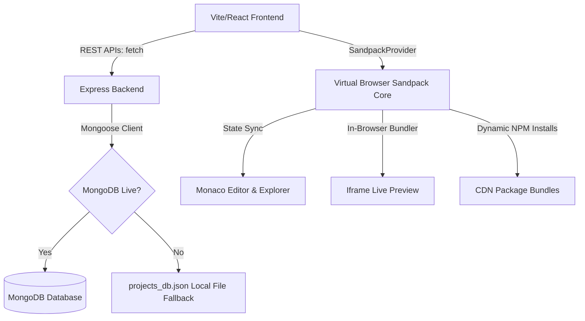

# ⚡Developer Sandbox - Browser-Based Coding IDE

A premium, full-stack browser-based developer assessment workspace built on the **MERN Stack** (MongoDB, Express, React, Node.js). This application enables candidates to write code, install external npm packages, manage files/folders, preview their applications in real-time, and persist their sandbox session across reboots.

---

## 🚀 Key Features

*   **Monaco Code Editor**: Core editor powered by Monaco Editor (the heart of VS Code). Supports full syntax highlighting, tabbed workspace, custom configurations, smooth caret animations, and automatic word wrap.
*   **Near Real-time Browser Compilations**: Embedded iframe live preview compiler powered by CodeSandbox Sandpack core, reacting instantly to updates.
*   **Virtual File Manager**: Sidebar file explorer tree enabling creation, nested folder management, and safe deletion of workspace files.
*   **Dynamic NPM Package Installer**: Sidebar package manager listing active dependencies, recommending popular additions, and performing safe in-browser npm installations.
*   **Double-Safe Session Persistence**: Seamless backend syncing backed by a **MongoDB failsafe fallback** that automatically starts an offline JSON database (`projects_db.json`) if a MongoDB connection fails, ensuring zero-config out-of-the-box evaluation!
*   **Vibrant Glassmorphic Aesthetics**: Modern dark-mode IDE with glowing states, fluid transitions, collapsible tabs, and custom logs terminal display.

---

## 📁 Repository Structure

```
/banao-assignment
  ├── package.json               # Root orchestrator scripts (run dev concurrently)
  ├── README.md                  # Comprehensive documentation
  ├── /backend
  │   ├── server.js              # Express API Server, default project models & fallback DB
  │   ├── package.json           # Backend dependency lists (Express, Mongoose)
  │   ├── projects_db.json       # Offline local JSON database failover file
  │   └── .env.example           # Server port & database URI guidelines
  └── /frontend
      ├── index.html             # Google fonts & typography tokens
      ├── vite.config.js         # Port mapper and backend proxy settings
      ├── package.json           # Frontend tools (React 18, Monaco, Sandpack, Lucide)
      └── /src
          ├── main.jsx           # React app bootstrap
          ├── index.css          # CSS Variables, custom scrollbars, transitions
          ├── App.jsx            # Main workspace orchestrator & debounced auto-saver
          └── /components
              ├── Sidebar.jsx          # Vertical navigation
              ├── FileExplorer.jsx     # Recursive virtual directory explorer
              ├── PackageManager.jsx   # package.json dependency updater
              ├── ProjectList.jsx      # Saved sessions CRUD panel
              ├── EditorContainer.jsx  # Tabs switcher & Monaco integration
              ├── PreviewContainer.jsx # Live frame and logs terminal panels
              └── StatusBar.jsx        # Active indicators and connection monitors
```

---

## 🛠️ Installation & Run Instructions

The workspace is set up to install all dependencies and run both servers simultaneously using a single terminal launcher.

### 1. Fast Setup
Run the following script at the root directory (`/banao-assignment`) to perform standard npm installations for both frontend and backend:
```bash
npm run install-all
```

### 2. Run the IDE
Start the Express server and Vite frontend concurrently with:
```bash
npm start
```
*   **Frontend Workspace**: [http://localhost:3000](http://localhost:3000)
*   **Backend Server Port**: [http://localhost:5000](http://localhost:5000)

*Note: The Express backend will automatically look for a MongoDB server at `mongodb://localhost:27017/banao_sandbox`. If it isn't running or fails to connect in 2.5 seconds, it will log a warning and activate the **Local JSON DB Failsafe**, ensuring the IDE remains fully usable without configuration!*

---

## 🏗️ Architectural Flow & Tech Choices


 
```
Vite/React Frontend  ──► REST APIs (fetch) ──► Express Backend
                                                     │
                                          ┌──────────┴──────────┐
                                          ▼                      ▼
                                    MongoDB (live)     projects_db.json
                                                         (fallback)
 
SandpackProvider ──► Monaco Editor (active state sync)
                 ──► In-Browser Bundler ──► iframe Live Preview
                 ──► Dynamic NPM installs via CDN
```
### 1. In-Browser Compilation: Sandpack vs WebContainers
 
**Choice:** CodeSandbox Sandpack Core.
 
**Rationale:** StackBlitz WebContainers runs a full Node.js terminal in WebAssembly but requires custom COOP/COEP security headers that block loading images, fonts, and package scripts from external CDNs — making local hosting highly complex. Sandpack runs React, HTML, and Vue templates natively in an isolated iframe, transpiles code client-side, loads dependencies instantly via CDN, and includes built-in HMR and a terminal console aggregator. The right tradeoff for a self-contained, zero-config assessment environment.
 
### 2. Double-Buffered Code State
 
The workspace maintains two parallel state layers:
 
| Layer | Description |
|---|---|
| **Client-Side Cache (Active)** | Managed in-browser by the Sandpack provider. Every keystroke in Monaco or directory change instantly feeds into the Sandpack runtime — zero latency. |
| **Server-Side Sync (Persistent)** | Handled via debounced API calls. Each file update starts a 1500 ms countdown. If the user keeps typing, the countdown resets. Once idle, a single sync request fires. |
 
This guarantees low server load and fluid performance while maintaining reliable session persistence.
 
### 3. Dynamic Remount Key on SandpackProvider
 
A core technical challenge was ensuring that loading a new project properly cleared the active Sandpack session. Setting `key={activeProject._id}` on `SandpackProvider` forces React to fully unmount and remount the provider when the project changes — wiping all internal bundler state and solving stale closure issues.
 
---
 
## 🐛 Bug Fix: Broken Session Persistence
 
### The Problem
 
When loading a saved project, the Monaco editor and Sandpack preview were not fully refreshing — files from the previous session or a mix of old and new content appeared instead of the loaded project.
 
### Root Cause Analysis
 
Three separate issues compounded:
 
1. **SandpackProvider lifecycle** — The provider stayed mounted across project switches. Updating its `files` prop triggered a re-render but not a remount, so internal Sandpack state (active file cursor, bundler module registry, HMR cache) held stale values from the prior session.
2. **Auto-save race condition** — The debounced auto-save fired during a project fetch. The component initialised with empty state before the fetch completed, so the empty file map was written back to the database — overwriting the previously saved project files.
3. **Inconsistent `_id` format in JSON fallback** — `projects_db.json` was generating IDs in a different format from MongoDB ObjectIDs, causing the remount key to not match reliably in offline mode.
### Fixes Applied
 
**Fix 1 — Dynamic remount key**
 
```jsx
<SandpackProvider
  key={activeProject._id}   // forces full unmount + remount on project switch
  files={activeProject.files}
  template="react"
>
```
 
When the active project changes, React sees a new key and fully unmounts the old `SandpackProvider`, destroying all internal state. The new provider initialises fresh with the correct file map.
 
**Fix 2 — `isLoadingProject` guard**
 
```js
const [isLoadingProject, setIsLoadingProject] = useState(false);
 
// In the debounced save effect:
if (isLoadingProject) return;
debouncedSave(activeProject);
 
// In the project load handler:
setIsLoadingProject(true);
const project = await fetchProject(id);
setActiveProject(project);
setIsLoadingProject(false);
```
 
Blocks the debounced save from firing while a project fetch is in progress — eliminating the race condition.
 
**Fix 3 — Consistent `_id` format in fallback DB**
 
```js
// server.js — generate MongoDB-compatible IDs in offline mode
function generateId() {
  return Date.now().toString(16).padStart(8, '0')
    + Math.random().toString(16).slice(2, 18).padStart(16, '0');
}
```
 
Ensures `key={activeProject._id}` works identically in both MongoDB and JSON fallback modes.
 
**Result:** Project switching now fully resets the editor, preview, active file tab, and bundler state. Auto-save race conditions on load are eliminated. Both MongoDB and JSON modes behave identically.
 
---
 
## 🤖 AI Leverage & Prompt Engineering Workflow
 
AI was used as an active pair programmer — accelerating implementation of well-defined tasks while architectural decisions remained the developer's own.
 
### Where AI helped
 
| Area | How AI Was Used |
|---|---|
| CSS Design Tokens | Crafted neon hue variables, custom scrollbar styles, and glassmorphic layout systems inside `index.css` |
| Failsafe Middleware | Designed the MongoDB connection timeout logic in `server.js` — auto-writing to `projects_db.json` when the primary DB is unreachable |
| Remount Strategy | Proposed the `key={activeProject._id}` pattern after the developer described stale closure behaviour during project switching |
| Boilerplate | Generated repetitive component scaffolding (Sidebar, StatusBar, FileExplorer) from natural language descriptions |
 
### Where the developer reasoned independently
 
- **Sandpack vs WebContainers** — researched COOP/COEP header constraints and made the tradeoff call based on hosting requirements
- **Debounce timing (1500 ms)** — tuned through manual testing to balance save frequency against typing fluidity
- **Virtual folder path model** — designed the flat key map structure and deletion logic independently
- **Double-buffered state architecture** — designed the two-layer pattern (client cache + server sync) before implementation
> AI was a pair programmer, not an author. Architectural decisions, debugging reasoning, and all final implementation choices were made by the developer.
 
---
 
## ⚖️ Technical Trade-offs & Known Limitations
 
### Trade-offs
 
| Trade-off | Detail |
|---|---|
| Client-Side Transpilation | The bundler runs inside the browser. Large packages (e.g. three.js) may take a few seconds to compile on slower devices. |
| Virtual Folder Model | Sandpack files are stored as flat path keys in-memory. Deleting a folder purges all files with that path prefix. |
| Debounced Save Latency | A 1500 ms idle window means a hard browser crash within this window could lose the last few keystrokes. |
 
### Known Limitations
 
- **Node native libraries** — the Sandpack compiler cannot execute server-only packages (`child_process`, `fs`, `net`, etc.) as it runs sandboxed in a browser context.
- **Vite configuration** — users can edit `.jsx`, `.css`, and `.json` files. Core Vite config is managed internally by the Sandpack compiler core.
- **Large bundle sizes** — packages over ~2 MB may cause noticeable compile delays due to browser-side bundling constraints.
---
 
## 📹 Video Walkthrough Notes
 
### Segment 1 — Opening 
- Show the running IDE: editor, preview panel, and sidebar all on screen
- State the stack: React 18 + Vite, Express + Node.js, MongoDB with JSON fallback
- Key constraint: zero-config startup and reliable session persistence for evaluators
### Segment 2 — Architecture 
- Sandpack over WebContainers — COOP/COEP header problem and why Sandpack wins here
- Double-buffered state — show the 1500 ms debounce in `App.jsx`
- Dynamic `key` on `SandpackProvider` — how React uses it to force a full remount
- MongoDB failsafe — walk both code paths in `server.js`
### Segment 3 — AI Usage 
- What was prompted: CSS tokens, failsafe middleware, remount pattern, component boilerplate
- Where AI accelerated: debugging session persistence after describing the stale closure behaviour
- Developer-only decisions: Sandpack selection, debounce timing, virtual path model design
### Segment 4 — Bug Fix Demo 
- Describe the bug: project switching not resetting editor and preview
- Explain the three root causes: lifecycle, race condition, inconsistent IDs
- Show each fix in code: key prop, `isLoadingProject` guard, `generateId()` in fallback DB
- Demonstrate live: load a saved project, show files and preview reloading correctly
### Segment 5 — Closing 
- Acknowledge limitations: no Node-native packages, no Vite config editing, large bundle latency
- Future improvements: WebContainers for Node.js support, socket.io collaborative cursors, diff-based sync
- Final demo: `npm start` from a clean terminal, JSON fallback activating, load and save a session
